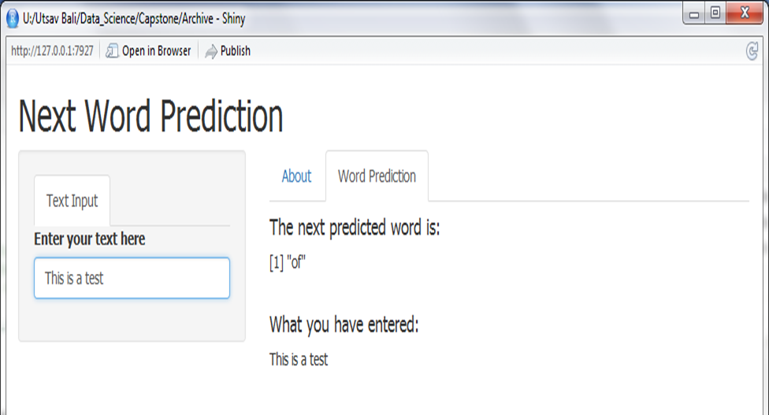

## Objective
This presentation introduces an application that was developed as a capstone project for the Coursera Data Science specialization. The objective is to build a Shiny application that predicts the next word in a sequence of texts entered by a user as seen in predictive text applications used in mobile phones. This project was developed in cooperation with <a href="https://swiftkey.com">Swiftkey</a>.
This slide deck includes five slides developed using Slidify and is hosted on GitHub. 

- Links to Project App & Docs 
- <a href="https://ubali1.github.io/Capstone_Slidify/">This presentation</a>
- <a href="https://ubali1.shinyapps.io/DSS_Capstone/">Shiny App</a>
- <a href="https://github.com/ubali1/DSS_Capstone">Github repo</a>

--- 

## Data Source
The source text data used for creating a Corpus was downloaded from <a href="https://www.corpora.heliohost.org">HC Corpora </a> and used to generate Term Document Matrices. 
The data set consists of text from 3 sources: News, Blogs and Twitter feeds and is provided in 4 languages. For this project, we analyzed the English data set. The following table summarizes the data set: 

<div style='text-align: center;'>
    
</div>

---

## Data preprocessing

A 10% sample of the data set downloaded from HC Corpora was preprocessed first. The sample was processed to remove emojis etc by converting sentences from UTF-8 to ASCII encoding. This was then followed by the removal of punctuations, whitespace, numbers etc. This was done using the tm package, as well as, the 'toSpace' functions to remove special characters.

A Corpus was subsequently generated which was used for <a href="https://en.wikipedia.org/wiki/Lexical_analysis#Tokenization">tokenization</a> and the generation of <a href="https://en.wikipedia.org/wiki/N-gram">n-grams</a>. I used the tokenize function in the quanteda package to tokenize the text sample and then used the data.table function to create the word dictionaries. 

---

## Word prediction

Data frames containing bi, tri and quad-gram frequency matrices were used for next word prediction which corresponded to the word with the highest frequency based on the sequence of preceding user input text.
A wordPrediction function then predicts that next word occurrence by interrogating the four ngrams data table (depending on the length (wordCount) of the input text) to find the next most frequently occurring word. 

An example code is represented below which is used to output the next word from the word dictionaries.


```r
      wordPrediction <- as.character(quadgram_Data[quadgram_Data$unigram==input_Text[1] & quadgram_Data$bigram==input_Text[2] & quadgram_Data$trigram==input_Text[3],][1,]$quadgram)

        if(is.na(wordPrediction)) {
          wordPrediction1 <- as.character(trigram_Data[trigram_Data$unigram==input_Text[2] & trigram_Data$bigram==input_Text[3],][1,]$trigram)
                        
          if(is.na(wordPrediction)) {
            wordPrediction <- as.character(bigram_Data[bigram_Data$unigram==input_Text[3],][1,]$bigram)
            }
        }

print(wordPrediction)
```

---

## Output

This application uses a shiny reactive function to generate the next word whilst the user is entering some text in the field and the predicted next word is outputted into a new cell along with the text inputted by the user. 

<div style='text-align: center;'>
    
</div>

The About tab gives a bit of background on the project.

---

